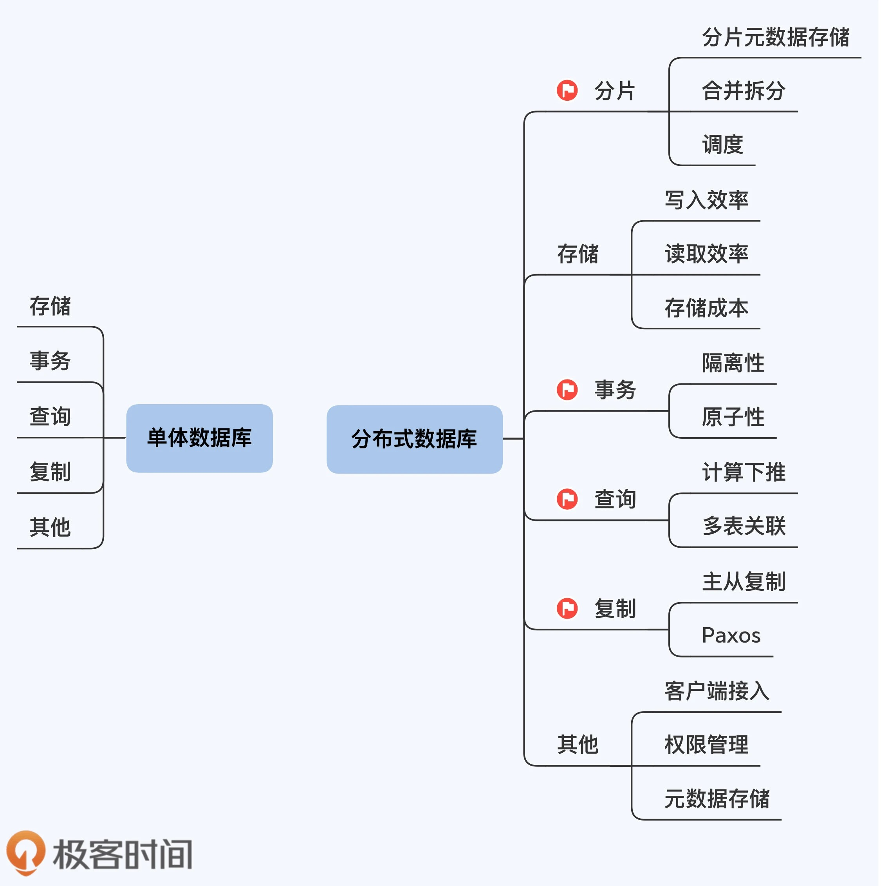
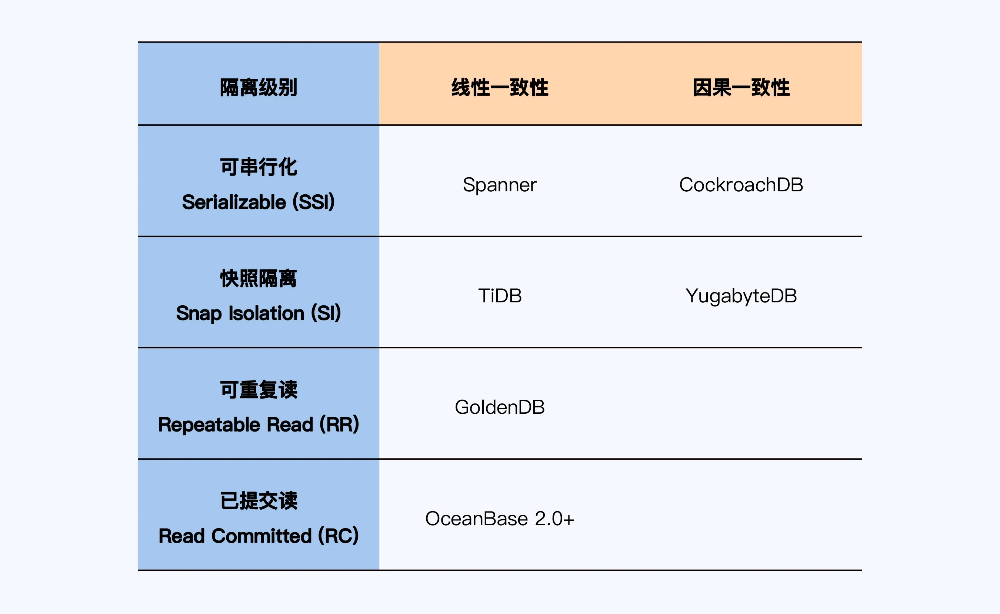

#### 											以下笔记来自极客时间课程《分布式数据库30讲》

**课程链接**：https://time.geekbang.org/column/intro/331?utm_source=time_web&utm_medium=menu&utm_term=timewebmenu

#### 开篇

#### 第一讲

1. 恢复时间目标（Recovery Time Objective, **RTO**）和恢复点目标（Recovery Point Objective, **RPO**）。

   RTO 是指故障恢复所花费的时间，可以等同于可靠性；RPO 则是指恢复服务后丢失数据的数量。数据库高可靠意味着 RPO 等于 0，RTO 小于 5 分钟。

#### 第二三讲

1. 分布式数据库的一致性，其实是**数据一致性**和**事务一致性**两个方面。

   

   

2. CAP的C是多副本、单操作的数据一致性；而ACID的C是单副本、多操作的事务一致性。

3. **BASE**：BA 表示基本可用性（Basically Available），S 表示软状态（Soft State），E 表示最终一致性（Eventual Consistency）。

4. **ACID**:

   

   ​	**一致性**，可以看作是对 “事务”整体目标的阐述，并没有提出任何具体的功能需求，所以在数据库中也很难找到针对性的设计。

   ​	**持久性**，核心思想就是要应对系统故障。可以把故障分为两种：

   ​	（1）存储硬件无损、可恢复的故障。这种情况下，主要依托于**预写日志（Write Ahead Log, WAL）**保证第一时间存储数据。WAL 采用顺序写入的方式，可以保证数据库的低延时响应。

   ​	（2）存储硬件损坏、不可恢复的故障。这种情况下，需要用到**日志复制技术**，将本地日志及时同步到其他节点。实现方式大体有三种：第一种是单体数据库自带的同步或半同步的方式，其中半同步方式具有一定的容错能力，实践中被更多采用；第二种是将日志存储到共享存储系统上，后者会通过冗余存储保证日志的安全性，亚马逊的 Aurora 采用了这种方式，也被称为 Share Storage；第三种是基于 Paxos/Raft 的共识算法同步日志数据，在分布式数据库中被广泛使用。无论采用哪种方式，目的都是保证在本地节点之外，至少有一份完整的日志可用于数据恢复。

5. **SQL-92：隔离级别**

   

   

   

   ​	**数据一致性**关注的是单对象、单操作在多副本上的一致性，**事务一致性**则是关注多对象、多操作在单副本上的一致性，分布式数据库的一致性是数据一致性与事务一致性的融合。

#### 第四讲

1. 数据库基本架构

   

2. 

